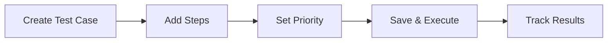
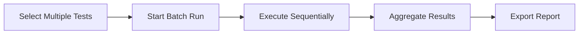
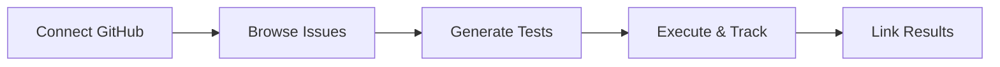

# QA Test Manager

A comprehensive manual test case management platform with GitHub integration, built with Next.js 15 and modern web technologies.


## 🚀 Features

### ✅ **Complete Test Case Lifecycle**
- **Manual Test Case Creation**: Rich editor with step-by-step test creation
- **Test Case Management**: Full CRUD operations with metadata tracking
- **Batch Test Execution**: Select and run multiple test cases simultaneously
- **Individual Test Execution**: Step-by-step execution with real-time results

### 📊 **Real-time Analytics Dashboard**
- **Live Statistics**: Test execution counts, pass rates, and trends
- **Activity Feed**: Recent test runs and case modifications
- **Progress Tracking**: Visual progress bars and completion statistics
- **Export Capabilities**: CSV export for detailed reporting

### 🔗 **GitHub Integration**
- **OAuth Authentication**: Secure GitHub login
- **Issue Browsing**: View and select GitHub issues for testing
- **AI-Powered Generation**: Automatically generate test cases from issues
- **Repository Integration**: Connect tests to specific GitHub repositories

### 🎨 **Professional UI/UX**
- **Dark/Light Themes**: Professional theming with shadcn/ui components
- **Responsive Design**: Works seamlessly on desktop and mobile
- **Accessibility**: WCAG compliant with proper contrast ratios
- **Modern Stack**: Next.js 15, TypeScript, Tailwind CSS

## 🛠️ Technology Stack

- **Frontend**: Next.js 15.4.2 with App Router
- **UI Framework**: shadcn/ui + Radix UI components
- **Styling**: Tailwind CSS v4 with custom theming
- **Authentication**: NextAuth.js with GitHub OAuth
- **Data Storage**: File-based system with Markdown and JSON
- **AI Integration**: OpenAI API for test case generation
- **GitHub API**: Octokit for repository and issue management

## 📋 Quick Start

### Prerequisites

- Node.js 18 or higher
- npm or yarn package manager
- Git for version control
- GitHub account (for OAuth authentication)
- OpenAI API key (optional, for AI test case generation)

### Installation

1. **Clone the repository**
   ```bash
   git clone https://github.com/synjan/qa-demo-1.git
   cd qa-demo-1
   ```

2. **Install dependencies**
   ```bash
   npm install
   ```

3. **Environment setup**
   ```bash
   cp .env.example .env.local
   ```

4. **Configure environment variables**
   ```env
   # NextAuth Configuration
   NEXTAUTH_URL=http://localhost:3000
   NEXTAUTH_SECRET=your-secret-key-here

   # GitHub OAuth
   GITHUB_CLIENT_ID=your-github-oauth-app-client-id
   GITHUB_CLIENT_SECRET=your-github-oauth-app-secret

   # OpenAI API (Optional)
   OPENAI_API_KEY=your-openai-api-key

   # GitHub Personal Access Token (Optional)
   GITHUB_TOKEN=your-github-personal-access-token
   ```

5. **GitHub OAuth Setup**
   - Go to [GitHub Developer Settings](https://github.com/settings/developers)
   - Create a new OAuth App with:
     - Homepage URL: `http://localhost:3000`
     - Authorization callback URL: `http://localhost:3000/api/auth/callback/github`

6. **Start the development server**
   ```bash
   npm run dev
   ```

7. **Open in browser**
   Navigate to [http://localhost:3000](http://localhost:3000)

## 🎯 Core Workflows

### Test Case Management


### Batch Execution


### GitHub Integration


## 📁 Project Structure

```
qa-demo-1/
├── src/
│   ├── app/                  # Next.js App Router pages
│   │   ├── api/             # API endpoints
│   │   ├── testcases/       # Test case management pages
│   │   ├── testplans/       # Test plan management pages
│   │   └── github/          # GitHub integration pages
│   ├── components/          # Reusable UI components
│   │   ├── ui/             # shadcn/ui components
│   │   ├── layout/         # Layout components
│   │   └── theme/          # Theme components
│   └── lib/                # Utility functions and types
├── testcases/              # Test case storage (Markdown)
├── testplans/              # Test plan storage (JSON)
├── results/                # Test results storage (JSON)
└── README.md
```

## 🌟 Key Features

### File-Based Storage
- **Git-friendly**: Version control for test cases
- **No Database Required**: Simple deployment
- **Human Readable**: Markdown and JSON formats
- **Portable**: Easy backup and migration

### AI-Enhanced Testing
- **Auto-Generation**: Create test cases from GitHub issues
- **Smart Analysis**: AI understands issue context
- **Customizable**: Edit generated test cases
- **Integration**: Seamless workflow with GitHub

### Batch Test Execution
- **Sequential Processing**: Execute multiple tests in order
- **Real-time Progress**: Live updates and statistics
- **Auto-save Results**: Automatic result persistence
- **Export Reports**: CSV export for analysis

## 📚 Complete Documentation

> **[🏠 Visit the Wiki](https://github.com/synjan/qa-demo-1/wiki)** for comprehensive documentation

### Quick Links
- **[📖 Installation Guide](https://github.com/synjan/qa-demo-1/wiki/Installation-Guide)** - Complete setup instructions with troubleshooting
- **[📘 User Manual](https://github.com/synjan/qa-demo-1/wiki/User-Manual)** - Detailed feature documentation and workflows
- **[🔧 API Reference](https://github.com/synjan/qa-demo-1/wiki/API-Reference)** - Complete API documentation with examples
- **[✨ Features](https://github.com/synjan/qa-demo-1/wiki/Features)** - Comprehensive feature overview
- **[🤝 Contributing](https://github.com/synjan/qa-demo-1/wiki/Contributing)** - Development guidelines and workflow
- **[🚨 Troubleshooting](https://github.com/synjan/qa-demo-1/wiki/Troubleshooting)** - Common issues and solutions

## 🚀 Deployment

### Vercel (Recommended)
```bash
npm install -g vercel
vercel --prod
```

### Docker
```bash
docker build -t qa-test-manager .
docker run -p 3000:3000 qa-test-manager
```

### Manual Deployment
```bash
npm run build
npm start
```

For detailed deployment instructions, see the [Wiki documentation](https://github.com/synjan/qa-demo-1/wiki).


## 🤝 Contributing

We welcome contributions! Please see our [Contributing Guide](https://github.com/synjan/qa-demo-1/wiki/Contributing) for details.

### Development Setup

1. Fork the repository
2. Create a feature branch: `git checkout -b feature/amazing-feature`
3. Make your changes
4. Run tests: `npm test`
5. Commit changes: `git commit -m 'Add amazing feature'`
6. Push to branch: `git push origin feature/amazing-feature`
7. Open a Pull Request

## 📄 License

This project is licensed under the MIT License - see the [LICENSE](LICENSE) file for details.

## 🔗 Links

- **[📚 Wiki Documentation](https://github.com/synjan/qa-demo-1/wiki)** - Complete documentation hub
- **[🚀 Latest Release](https://github.com/synjan/qa-demo-1/releases/latest)** - Download and release notes
- **[🐛 GitHub Issues](https://github.com/synjan/qa-demo-1/issues)** - Bug reports and feature requests
- **[💬 GitHub Discussions](https://github.com/synjan/qa-demo-1/discussions)** - Community discussions

## 📞 Support

Need help? Here are your options:

- **📚 Documentation**: [GitHub Wiki](https://github.com/synjan/qa-demo-1/wiki) - Comprehensive guides and documentation
- **🚨 Troubleshooting**: [Troubleshooting Guide](https://github.com/synjan/qa-demo-1/wiki/Troubleshooting) - Common issues and solutions
- **🐛 Bug Reports**: [GitHub Issues](https://github.com/synjan/qa-demo-1/issues) - Report bugs and request features
- **💬 Questions**: [GitHub Discussions](https://github.com/synjan/qa-demo-1/discussions) - Ask questions and get help

## 🏆 Acknowledgments

- Built with [Next.js](https://nextjs.org/)
- UI components by [shadcn/ui](https://ui.shadcn.com/)
- Icons by [Lucide](https://lucide.dev/)
- Styling with [Tailwind CSS](https://tailwindcss.com/)

---

**QA Test Manager** - Making manual testing efficient and enjoyable! 🎉
